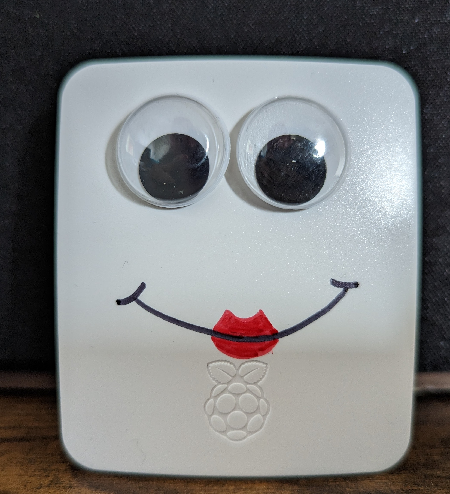
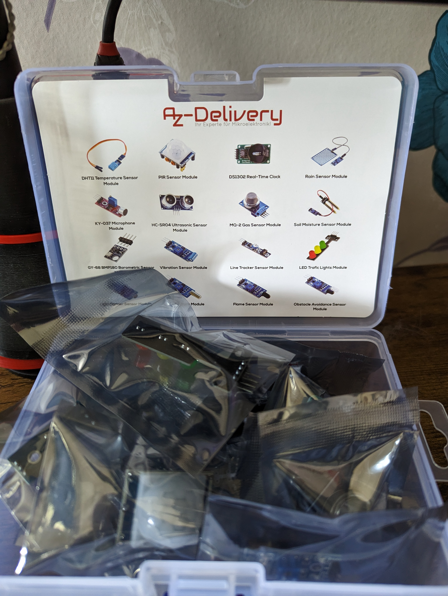
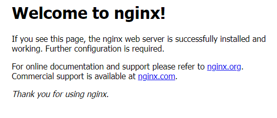

# Adventures With Penelopi

### Day 1 - 23/04/2023
Twas the night before the exam that marks the end of my first MSc Computing module. I couldn't face any more revision, and the poor, lifeless Raspberry Pi 3 that I'd bought myself as a reward for making it through the first Masters module, was sitting gathering dust on my desk. 

The aim of 'Adventures With Penelopi' is to figure out all the fun stuff that Pis can be used for, to learn Linux, and to learn Python. 

Plus, I've also got a big ol' box of sensors to play with. 

However, today's job was just set up and included the following: 

1. Download Raspberry Pi Imager. 
2. Open the secret menu to prefill wifi and configure SSH. I'm planning on using this headless (no escape from using the terminal if you have no peripherals!) so this all needed setting up at the same time as the OS. 
3. Pick my OS (I went for the standard Raspberry Pi OS. There's time to explore later.), reunite Penelopi with her Micro SD and turn the old girl on. 
4. Check it's connecting to my wifi by looking at the router admin and giving her a ping. 
5. Update and upgrade packages (and try to figure out the best way to give Penelopi some hair while they were running...).
6. Run raspi-config to change the hostname to 'Penelopi'.
7. Reboot and re-ping her new hostname to check it all worked and she's still connecting to the wifi on startup.  

### Day 2 - 08/05/2023 - The Web Server Adventure
While I have a load of sensors ready to go, it turns out I assumed that Penelopi could telepathically connect to them, so I did not think about getting any wires. They should be arriving tomorrow. They will also function as hair. 

While I'm waiting, we're jumping forward a little. The ultimate aim is for random strangers to be able to control Penelopi and her random array of sensors (and potentially robot arms/legs/wheels... I haven't decided yet) through a web app. So, tonight's job was to set her up as a web server and make her publically accessible.

As a disclaimer, this was thrown together as a first attempt. It's probably not best practice in any way, since there is no real config anywhere, and zero consideration given to security. It's a first pass, and I'll refine security later.  

Process was as follows: 
1. Go into the router admin panel (after restoring the router to factory settings because I forgot what I set the admin password to...) and make sure Penelopi is set to be allocated a static IP.
2. In the router admin, create a firewall rule to redirect any http traffic that hits my external IP on port 80 to Penelopi's internal IP (also port 80). There was an option to be safe and only accept traffic from certain sources, so I could limit it to my phone and my not-in-the-house testing assistant, but this seemed less fun. 
3. SSH into the old girl and apt-get nginx. This automatically starts it. Thank you to whoever made that setup the easiest install possible. 
4. Figure out what my external IP is, switch off the wifi on my phone to make sure it's actually accessible from external, navigate to the IP, and get excited because this glorious page is displayed.

5. Figure out where the default web page is hosted. As a software engineer who works in .NET, Angular and IIS, my life is Microsoft-heavy, and I've never used nginx before, so I had no idea about the folder structure/location. Turns out, the details of default pages are all kept here: /etc/nginx/sites-available/default. This directed me to default pages in var/www/html.
6. In var/www/html, create index.html, sudo it in nano (because apparently you don't have permissions to save by default as a non-sudo), and boiler plate it. Function first, prettifying later.  
7. Refresh the page, and celebrate. 

 

 
