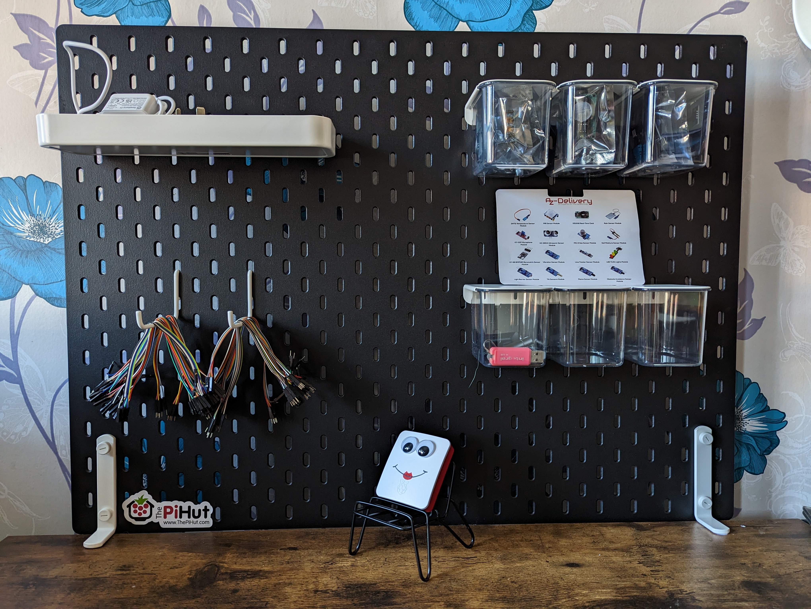

# Adventures With Penelopi

## Day 1 - 23/04/2023
Twas the night before the exam that marks the end of my first MSc Computing module. I couldn't face any more revision, and the poor, lifeless Raspberry Pi 3 that I'd bought myself as a reward for making it through the first Masters module, was sitting gathering dust on my desk. 

The aim of 'Adventures With Penelopi' is to figure out all the fun stuff that Pis can be used for, to learn Linux, and to learn Python. 

Plus, I've also got a big ol' box of sensors to play with.  

However, today's job was just set up and included the following: 

1. Download Raspberry Pi Imager. 
2. Open the secret menu to prefill wifi and configure SSH. I'm planning on using this headless (no escape from using the terminal if you have no peripherals!) so this all needed setting up at the same time as the OS. 
3. Pick my OS (I went for the standard Raspberry Pi OS. There's time to explore later.), reunite Penelopi with her Micro SD and turn the old girl on. 
4. Check it's connecting to my wifi by looking at the router admin and giving her a ping. 
5. Update and upgrade packages (and try to figure out the best way to give Penelopi some hair while they were running...).
6. Run raspi-config to change the hostname to 'Penelopi'.
7. Reboot and re-ping her new hostname to check it all worked and she's still connecting to the wifi on startup.  

## Day 2 - 08/05/2023 - The Web Server Adventure
While I have a load of sensors ready to go, it turns out I assumed that Penelopi could telepathically connect to them, so I did not think about getting any wires. They should be arriving tomorrow. They will also function as hair. 

While I'm waiting, we're jumping forward a little. The ultimate aim is for random strangers to be able to control Penelopi and her random array of sensors (and potentially robot arms/legs/wheels... I haven't decided yet) through a web app. So, tonight's job was to set her up as a web server and make her publically accessible.

As a disclaimer, this was thrown together as a first attempt. It's probably not best practice in any way, since there is no real config anywhere, and zero consideration given to security. It's a first pass, and I'll refine security later.  

Process was as follows: 
1. Go into the router admin panel (after restoring the router to factory settings because I forgot what I set the admin password to...) and make sure Penelopi is set to be allocated a static IP.
2. In the router admin, create a firewall rule to redirect any http traffic that hits my external IP on port 80 to Penelopi's internal IP (also port 80). There was an option to be safe and only accept traffic from certain sources, so I could limit it to my phone and my not-in-the-house testing assistant, but this seemed less fun. 
3. SSH into the old girl and apt-get nginx. This automatically starts it. Thank you to whoever made that setup the easiest install possible. 
4. Figure out what my external IP is, switch off the wifi on my phone to make sure it's actually accessible from external, navigate to the IP, and get excited because this glorious page is displayed. 
5. Figure out where the default web page is hosted. As a software engineer who works in .NET, Angular and IIS, my life is Microsoft-heavy, and I've never used nginx before, so I had no idea about the folder structure/location. Turns out, the details of default pages are all kept here: /etc/nginx/sites-available/default. This directed me to default pages in var/www/html.
6. In var/www/html, create index.html, sudo it in nano (because apparently you don't have permissions to save by default as a non-sudo), and boiler plate it. Function first, prettifying later.
7. Refresh the page, and celebrate. 

 

## Day 3 - 14/5/2023 - The Flask Saga
Before we start, the wires arrived, and Penelopi has a snazzy new station to keep all of her bits together. Thank you IKEA.  

As a result of tonight's work, there is now a working web server running an interactive Flask application. All the code for this part is in the flask_project directory. 

### The Flask Saga - Part One
I started with getting Flask set up on my dev machine (which is Windows - I have a laptop with a Linux partition on it, but for some reason I always end up using my main machine instead). Process was along the lines of: 

1. Download and install python. 
2. Create the project folder.
3. Create a virtual environment folder and activate the environment. 
4. Install flask using pip. 
5. Install flask-wtf so I could use snazzy form stuff. 
6. Create the app.py file, a couple of html templates in a separate template folder and a forms.py file to hold the form classes.

At this point, I had a fun little error where VS Code couldn't resolve the Flask import. Turns out I had two python installs - one global and one within the virtual environment. In the bottom right of VS Code there is a little button that allows you to change which python install it's using.

I'll admit that building the application took me a flippin age. For some reason, the submit button would only do a GET request, and I could not get any parameters to be passed anywhere. Eventually, I came across some stuff about Flask WTF (a form library), which also suggested storing the form data in a session variable, which solved my problems. 

### The Flask-Saga - Part Two
Once the application was built and working locally, it was time to move it to Penelopi and get it running externally.

To begin with, I went about this in the same way as I did on my windows machine (ie. create project folder, virtual environment, scp my folder structure in). Following a tutorial, I installed gunicorn and tried to configure all that shizzle and point my nginx server at it. Again, could not get any of this config to work. There were issues with gunicorn being installed globally and not in the virtual environment, which messed up the proxy, and issues with setting up systemctl services. Everything seemed overcomplicated, which, in my experience, generally means there's a better way (although this is my first time working with nginx/gunicorn/python/flask so what do I know?).

Turns out there was an easier way. Process followed was: 
1. Create project folder. 
2. Create templates folder and use touch/nano to create the Index.html and Result.html files. No scp this time, to avoid any conflicts with dependencies/versioning that might cause problems. 
3. Install python, flask, gunicorn, flask-wtf.
4. Don't bother with the virtual environment malarky. Create an __init__.py file and put all the stuff that was in app.py (the routing, basically) in there. 
5. Create /ect/nginx/sites-enabled/flask_project and make sure it's pointing at my external ip. 
6. Unlink the /etc/nginx/sites-enabled/default, because you want the flask_project one to replace it. 
7. Restart nginx. At this point, I saw a bad gateway error because nginx was pointed at the internal ip that gunicorn would be running the application on, but gunicorn was not yet running the flask project. 
8. In the project's parent folder (in my case, this was SweetiePi's home directory) run the following command to assign gunicorn 3 workers and to set the application that it should run. 
	gunicorn -w 3 flask_project:app
	
At this point, a refresh of the website showed it was working. Celebratory tea was made. 

Credit to this <a href="https://www.youtube.com/watch?v=KgAtZ1LlNiQ&ab_channel=Linode">magic man's helful video.</a>
